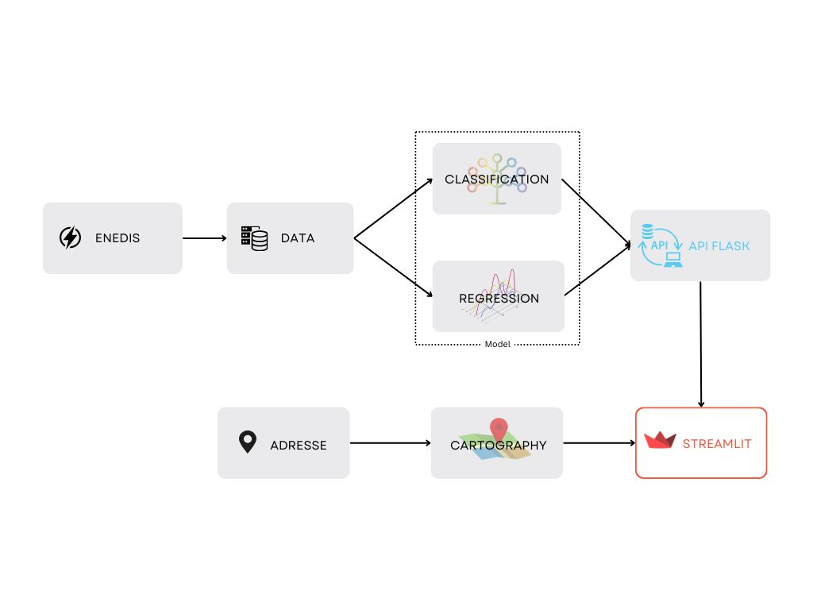
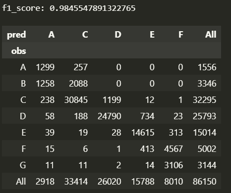

# Documentation Technique du Système de Prévision de Consommation Énergétique

## Aperçu Général

Cette architecture représente notre système de prévision de la consommation énergétique et de classification des logements en fonction de leur performance énergétique (DPE). Elle intègre des sources de données externes provenant d'Enedis, des modèles de machine learning pour la classification et la régression, une API pour l'interfaçage et une interface utilisateur pour la visualisation des données et la cartographie.

## Composants Principaux

### 1. Source de Données
  **ENEDIS** : La source principale des données est Enedis, qui fournit des informations sur la consommation énergétique des logements. Ces données sont récupérées via une API et stockées dans une base de données centralisée pour l'analyse et la construction des modèles.

### 2. Stockage des Données
  **DATA** : Les données extraites d'Enedis sont stockées dans un fichier CSV, qui sert de source de données pour les modèles de machine learning de classification, de régression et pour la visualisation des données. Ce fichier `Data/data_carto` est également accessible via [l'API](https://performance-energetique-server.onrender.com).

### 3. Modèles de Machine Learning
   - **Classification** : Ce modèle est utilisé pour classifier les logements selon leur étiquette DPE (Diagnostic de Performance Énergétique). Il a été construit en utilisant l'algorithme Random Forest avec 10 arbres. Nous avons obtenu les scores suivants :
     

   - **Régression** : Ce modèle prédit la consommation énergétique des logements en utilisant des algorithmes de régression. Il a été construit en utilisant l'algorithme Random Forest Regressor avec 5 arbres. Nous avons obtenu les scores suivants :
     

### 4. API Flask
**API FLASK** : Une API développée avec Flask permet d'exposer les modèles de machine learning et les données en tant que services web. Cette API permet de faire des prédictions en temps réel via des appels API externes. Elle communique avec les modèles de classification et de régression et renvoie les résultats de prédiction aux applications clientes.

[La documentation est disponible ici](https://performance-energetique-server.onrender.com)

**Endpoints** : L'API comporte différents endpoints pour :
   `https://performance-energetique-server.onrender.com`
   - **GET**
     - **/data** : Pour accéder aux données.
   - **POST**
     - **/classification** : Envoyer les données d'un logement et récupérer l'étiquette DPE prédite.
     - **/regression** : Envoyer les caractéristiques d'un logement et obtenir une estimation de la consommation énergétique.

### 5. Interface Utilisateur avec Streamlit
Une interface utilisateur (UI) est développée avec **Streamlit** pour permettre aux utilisateurs finaux de visualiser les résultats des modèles et d'interagir avec les données de manière intuitive.

Elle comporte plusieurs onglets :
   - **Accueil** : Brève présentation de notre projet.
   - **Contexte** : Visualisation des données.
   - **Cartographie** : Ce composant gère la géolocalisation des logements en fonction de leurs adresses. Les adresses sont transformées en coordonnées géographiques, permettant une visualisation géographique des performances énergétiques et de la consommation sur une carte.
   - **Prédiction de l'étiquette DPE** : Affiche les prévisions et les classifications des logements sous forme de graphiques et de cartes interactives, facilitant la prise de décisions éclairées.
   - **Prédiction de la consommation** : Affiche les prévisions de consommation des logements sous forme de graphiques et de cartes interactives.
   - **Analyses** : Les utilisateurs peuvent sélectionner des critères spécifiques pour explorer les données de consommation énergétique et les étiquettes DPE des logements dans leur région.

## Flux de Données

1. Les données sont récupérées depuis l'API d'Enedis et stockées dans une base de données centralisée.
2. Les données sont prétraitées et utilisées pour entraîner les modèles de classification et de régression.
3. Lorsqu'un utilisateur envoie une demande via l'interface Streamlit, l'API Flask est appelée pour obtenir une prédiction :
   - Le modèle de classification fournit une étiquette DPE.
   - Le modèle de régression prédit la consommation énergétique.
4. Les résultats sont renvoyés à l'interface utilisateur, où ils sont visualisés sur des cartes et des graphiques interactifs.

## Technologies Utilisées

- **API Enedis** : Source de données principale.
- **Python** : Langage principal pour le développement des modèles, de l'API et de l'interface.
- **Pandas, Scikit-Learn** : Pour le traitement des données et le développement des modèles de machine learning.
- **Flask** : Framework pour créer l’API RESTful.
- **Streamlit** : Outil pour développer une interface utilisateur interactive et accessible.
- **Cartographie (Plotly)** : Pour la représentation géographique des logements sur une carte.

## Cas d’Utilisation

1. **Prédiction de l’étiquette DPE** : L’utilisateur entre des informations sur un logement, et l’API renvoie une classification DPE.
2. **Estimation de la consommation énergétique** : L’utilisateur fournit des caractéristiques du logement, et l’API renvoie une estimation de consommation.
3. **Visualisation Géographique** : L’utilisateur explore une carte interactive pour voir les performances énergétiques des logements par zone géographique.
